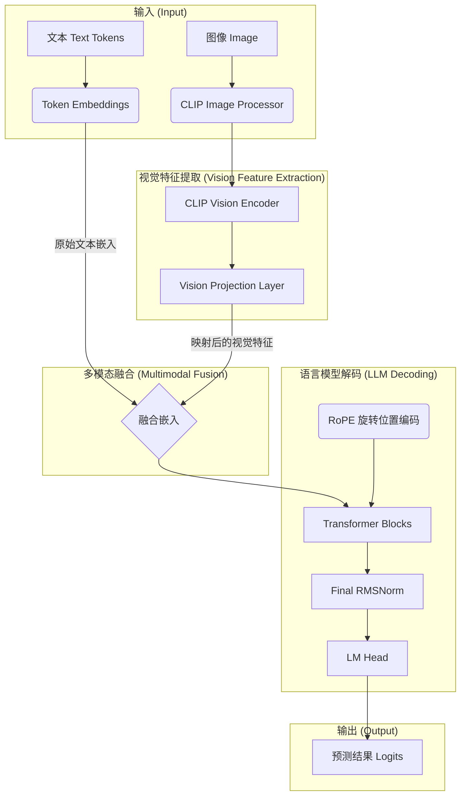

<!DOCTYPE html>
<html lang="zh-CN">
<head>
  <meta charset="UTF-8">
  <meta name="viewport" content="width=device-width, initial-scale=1">
  <title>亲手在Colab上复现MiniMind-V：从Bug到模型的全记录</title>
  <meta name="description" content="从Colab复现MiniMind-V模型的完整实战教程与调试心路历程，作者为jinv2，附模型与代码地址。">
  <meta name="author" content="jinv2">
  
</head>
<body>

<h1>亲手在Colab上复现MiniMind-V：从Bug到模型的全记录 (2025.07.15)</h1>

大家好，我是 <strong>jinv2</strong>。我的博客宗旨是：“<em>记录探索，分享实践，在代码的世界里留下自己的足迹</em>”。

我也是“<a href="https://jinv2.github.io" target="_blank">天算AI科技研发实验室</a>”的成员，我们的使命是：<strong>用AI技术推进创意智能与工具智能的发展，探索更高效、更开放的科研与开发路径</strong>。

今天要和大家分享的是一次完整的 Colab 实战经验：<strong>从零开始成功复现并训练 MiniMind-V 模型的全过程</strong>。这不仅是一篇教程，更是一份实战日志与Debug手册，完整记录了我从遇到bug、修复代码、GPU调优、构建脚本再到训练成功的全过程。

  <strong>🔗 本文涉及的开源地址：</strong> 
  📦 Hugging Face 模型：<a href="https://huggingface.co/jinv2/minivlm" target="_blank">https://huggingface.co/jinv2/minivlm</a> 
  💻 GitHub 仓库：<a href="https://github.com/jinv2/minivlm" target="_blank">https://github.com/jinv2/minivlm</a> 
  🧠 天算AI主页：<a href="https://jinv2.github.io" target="_blank">https://jinv2.github.io</a>

<h2>一、技术解析：MiniMind-V 的先进性</h2>

MiniMind-V 采用精巧的轻量化设计，主要组成包括：

<ul>
  <li><strong>CLIP Vision Encoder：</strong> 图像特征提取</li>
  <li><strong>轻量 Transformer LLM：</strong> 8层 Transformer 解码器</li>
  <li><strong>Vision Projection：</strong> 视觉特征与语言空间对齐</li>
  <li><strong>RoPE 相对位置编码：</strong> 高效建模长文本</li>
  <li><strong>现代组件：</strong> RMSNorm、SiLU 激活</li>
</ul>

<h2>二、知识图谱：MiniMind-V 架构图</h2>
<pre><code>

</code></pre>

<h2>三、Colab 实战日志：从“踩坑”到“通关”</h2>

<h3>1. 环境搭建与自动化脚本</h3>
<pre><code>!wget -q -O minimind-v-master.zip ...
!unzip -q minimind-v-master.zip
%cd minimind-v-master
!pip install -r requirements.txt
# 创建微型数据集...
</code></pre>

<h3>2. 修复 RoPE 维度 Bug</h3>
<pre><code># 错误示例：
RuntimeError: The size of tensor a (32) must match the size of tensor b (320)

# 修复方法：
self.cis = VLMConfig.precompute_cis(self.head_dim, self.config.max_seq_len)
</code></pre>

<h3>3. GPU 不启用 & 梯度消失</h3>
<pre><code># 错误设置：
os.environ["CUDA_VISIBLE_DEVICES"] = ""

# 修复：
- 显式设置 lm、lm_head、vision_proj 的 requires_grad=True
- 删除屏蔽 GPU 的环境变量
- 确保 Colab 设置为 GPU 环境
</code></pre>

<h3>4. 成功训练输出</h3>
<pre><code>[Train Epoch 1] step: 0, loss: 6.5223
[Train Epoch 2] step: 0, loss: 3.1027
[Train Epoch 5] step: 0, loss: 2.6605
</code></pre>

<h2>四、总结与展望</h2>
<ul>
  <li>深入理解 VLM 架构、RoPE 原理与梯度机制</li>
  <li>MiniMind-V 结构小巧，适合快速迭代与多模态实验</li>
  <li>后续计划：大数据微调 + 下游任务实战（图文问答、描述生成）</li>
</ul>

  💬 欢迎交流与支持： 
  ➤ Hugging Face 模型页：<a href="https://huggingface.co/jinv2/minivlm" target="_blank">jinv2/minivlm</a> 
  ➤ GitHub 项目源码：<a href="https://github.com/jinv2/minivlm" target="_blank">github.com/jinv2/minivlm</a> 
  ➤ 天算AI实验室主页：<a href="https://jinv2.github.io" target="_blank">jinv2.github.io</a>

愿我们每一次手动实践，都成为未来更强大AI的种子。

</body>
</html>
