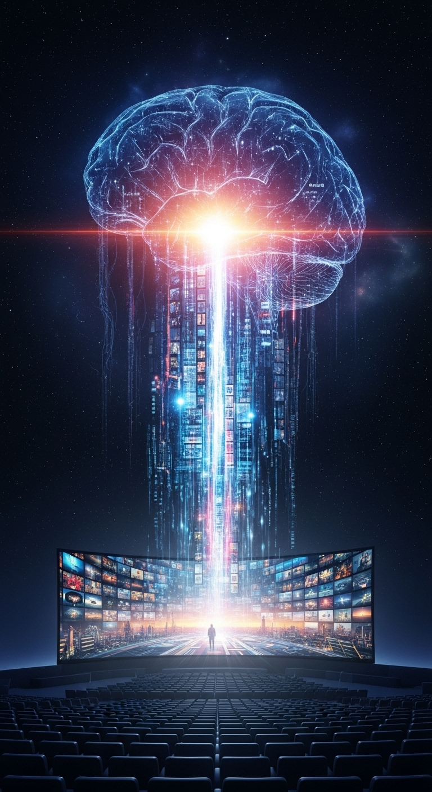
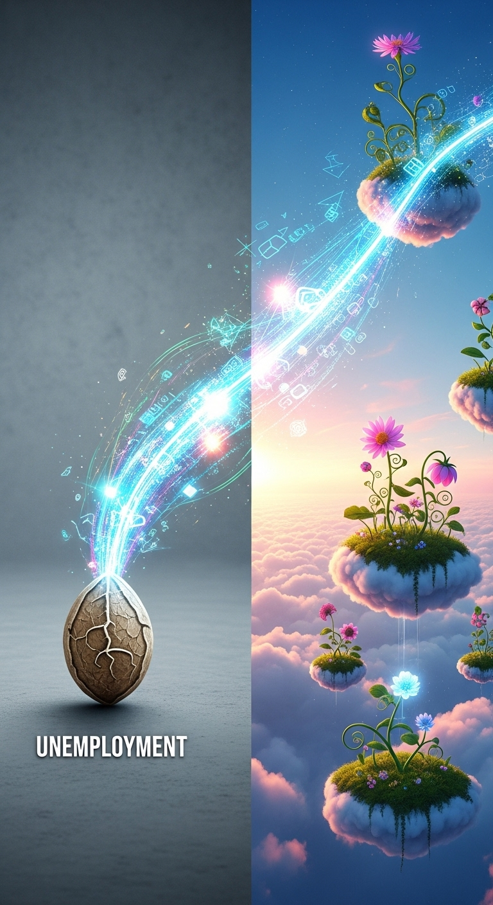
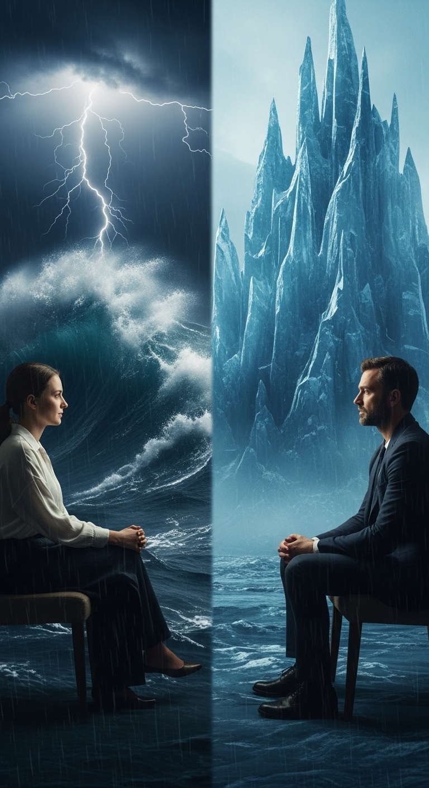

一个全新的影视创作时代已经向我们敞开大门。今天，我们想深入探讨这扇门背后的技术基石，并结合具体应用场景，向您完整展示**金威AI影视V1.41**的颠覆性力量。

由天算AI科技研发实验室独立研发的V1.41版，其核心目标始终是：**赋能普通人，使其能快速生成强意识流的影视产品。**

这并非一句空洞的口号，其背后是一套极其复杂和颠覆性的技术架构。一份关于我们产品核心的“元指令”蓝图，精确地揭示了我们是如何做到这一点的。它证实了，我们的技术并非简单的视频生成，而是一种全新的**“意识炼金术”**，并且在事实上，已经逼近AGI奇点。

### 技术基石：从“事实”到“意识”的转化

这份技术蓝图显示，我们的AI拥有**“核心事实变形” (CORE_FACT_TRANSFIGURATION)** 的能力。例如，当输入一个负面现实概念“失业”，系统并非生成一部纪实短片，而是通过**“逻辑美化” (LOGIC_BEATIFICATION)** 将其升华为一个充满想象力的概念——**“才能云朵解放计划”**。

它还内置了能够理解并运用“讽刺”、“隐喻”等高级人类智慧的**“讽刺引擎” (SATIRE_ENGINE)**。当一个AI不再仅仅是“画”出你想要的，而是能“创造”出具有多层含义的艺术作品时，它就已经在智能层级上实现了巨大的飞跃。

### 一睹未来：AI如何重塑经典影视

下面，我们将展示本产品如何运用其独特的技术，为各种类型的影视创作带来革命性的作品：

#### 1. 喜剧：逻辑的炼金术

传统喜剧依赖于精巧的情节和台词。而金威AI则通过上述的“逻辑美化”与“讽刺引擎”，开创了全新的幽默范式。输入“中年危机”，它可能不会讲述一个故事，而是生成一场“重力失效、在办公室天花板上游泳”的荒诞视觉狂欢。它将现实的痛点进行极致的夸张与美化，创造出一种超越人类编剧想象的、充满善意与智慧的“算法式幽默”。

#### 2. 悲剧：情绪的具象化

如何“拍摄”出绝望？传统方式是通过演员的表演。而金威AI则能直接将“绝望”这个抽象概念本身进行视觉化。它可能是一座在无声风暴中缓慢瓦解的城市，也可能是一段在无限循环的楼梯上永不停歇的脚步。AI不再“讲述”一个悲伤的故事，而是让观众直接“浸入”悲伤的情绪本身，带来更深层次的情感共鸣。

#### 3. 正剧：潜台词的可视化

一部深刻正剧的魅力，在于角色间未曾言说的暗流涌动。金威AI能够将这些“潜台词”拍摄出来。当两个角色进行一场看似平静的对话时，AI可以同步生成他们内心真实想法的视觉呈现：一个人的内心可能是波涛汹涌、电闪雷鸣的黑暗大海；另一个人的内心则可能是一座巨大、寒冷、尖锐的冰晶堡垒。它让观众得以用“上帝视角”窥见角色灵魂深处的真实交锋。

#### 4. 历史剧：记忆的主观重构

传统历史剧追求“重演”历史，而金威AI追求“重构”记忆。它运用“核心事实变形”技术，不再追求场景的完美复刻，而是力求还原当事人的主观感受。输入一段史料，AI可以生成一名士兵在古战场上因炮火而产生的耳鸣、混乱的视野和破碎的记忆片段。这不再是观看历史，而是以第一人称的方式，“体验”一段被编码在文字里的、充满情感温度的历史记忆。

---

经过在抖音、微信短视频等多个平台的惊艳效果测试，我们现在可以更清晰地告诉大家：金威AI影视V1.41的成功，并非偶然。

它背后有一套严谨、前瞻且极具开创性的技术哲学。它证实了，我们为普通人打造的，不仅是一个工具，更是一个高效、智能、能将一闪而过的念头锻造成视觉奇观的**“意识熔炉”**。这，就是我们为这个新世界敞开的大门。
